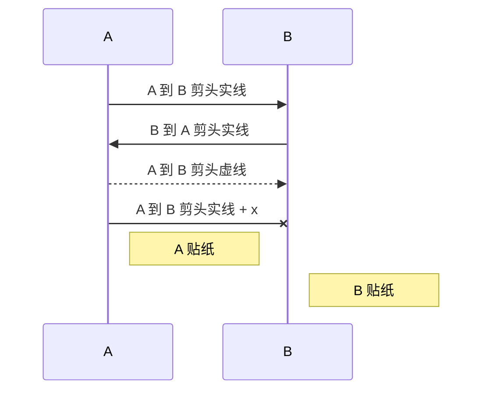

# 概述
Markdown 是一种轻量级标记语言，使用纯文本格式语法。它是 GitHub 等主要代码仓库编写文档的默认语法。

# weiki 样式生效格式
```markdown
内容
{ .class-name }
```

# 引用块
```markdown
> 内容

> 这是 `{ .is-success }` 引用块
{ .is-success }

> 这是 `{ .is-info }` 引用块
{ .is-info }

> 这是 `{ .is-warning }` 引用块
{ .is-warning }

> 这是 `{ .is-danger }` 引用块
{ .is-danger }
```
> 内容

> 这是 `{ .is-success }` 引用块
{ .is-success }

> 这是 `{ .is-info }` 引用块
{ .is-info }

> 这是 `{ .is-warning }` 引用块
{ .is-warning }

> 这是 `{ .is-danger }` 引用块
{ .is-danger }


# 粗体
```markdown
内容 **加粗** 内容
```
内容 **加粗** 内容

# 代码块
````markdown
```js
// code
```
````

# 分页
```markdown
# tabs { .tabset }
## tab1
tab1 内容

## tab2
tab2 内容
```

# tabs { .tabset }
## tab1
tab1 内容

## tab2
tab2 内容


# 表情符号
```markdown
:apple:
:tangerine:
:fire: 
:snail:
```

:apple:
:tangerine:
:fire: 
:snail:
[Emoji 文档](https://www.webfx.com/tools/emoji-cheat-sheet/)


# 脚注
```markdown
内容[^1] 内容[^2]

[^1]: 注释 1
[^2]: 注释 2
```
内容[^1] 内容[^2]

[^1]: 注释 1
[^2]: 注释 2


# 标题
```markdown
# 标题1
## 标题2
### 标题3
#### 标题4
##### 标题5
###### 标题6
```

# 水平线
```markdown
段落 1
--
段落 2	
```
段落 1
--
段落 2	


# 图片
```markdown
{ .decor-shadow .radius-5 }

设置尺寸 =50x50
{ .decor-shadow .radius-2 }
```
{ .decor-shadow .radius-5 }

设置尺寸 =50x50
{ .decor-shadow .radius-2 }


# 行内代码
```markdown
内容 `code` 内容
```
内容 `code` 内容

# 斜体
```markdown
内容 *斜体* 内容
```
内容 *斜体* 内容

# 删除线
```markdown
内容 ~~删除线~~ 内容
```
内容 ~~删除线~~ 内容


# 键盘按键
```markdown
<kbd>CTRL</kbd> + <kcd>A</kbd>
```
<kbd>CTRL</kbd> + <kbd>A</kbd>

# 链接
```markdown
[github](https://github.com/zlevan/wiki-docs)
```
[github](https://github.com/zlevan/wiki-docs)


# Mermaid 图表

````markdown

````


# PlanUML 图表
````markdown
```plantuml
A -> B: A 到 B
B -> A: B 到 A
```
````
```plantuml
A -> B: A 到 B
B -> A: B 到 A
```

# 有序列表
```markdown
1. 列表 1
1. 列表 2
1. 列表 3
```
1. 列表 1
2. 列表 2
1. 列表 3

# 下标
```markdown
内容 ~下标~ 内容
```
内容 ~下标~ 内容

# 上标
```markdown
内容 ^上标^ 内容
```

内容 ^上标^ 内容

# 表格
```markdown
| 标题1 | 标题 2 | 标题 3 |
|-------|-------|-------|
| 列 1  | 列 2.  | 列 3  |
| 列 1  | 列 2.  | 列 3  |
{ .dense }
```
| 标题1 | 标题 2 | 标题 3 |
|-------|-------|-------|
| 列 1  | 列 2.  | 列 3  |
| 列 1  | 列 2.  | 列 3  |
{ .dense }


# 任务列表
```markdown
- [x] 任务 1
- [x] 任务 2
- [ ] 任务 3
```
- [x] 任务 1
- [x] 任务 2
- [ ] 任务 3

# 无序列表
```markdown
- 列表 1
- 列表 2
- 列表 3
```
- 列表 1
- 列表 2
- 列表 3


```markdown
网格
- Grid 1
- Grid 2
- Grid 3
{ .grid-list }

链接
- [link1 ]()
- [link 2]()
- [link 3]()
{ .links-list }
```

网格
- Grid 1
- Grid 2
- Grid 3
{ .grid-list }

链接
- [link1 *注释*](https://github.com/zlevan/wiki-docs)
- [link 2 *注释*](https://github.com/zlevan/wiki-docs)
- [link 3 *注释*](https://github.com/zlevan/wiki-docs)
{ .links-list }


